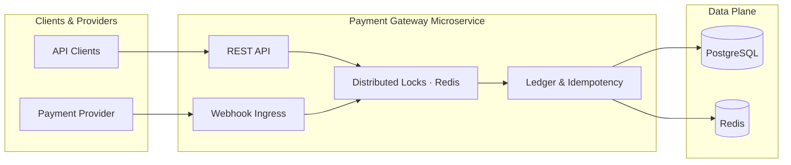

# Payment Gateway — Idempotent Payment Microservice

[](https://openjdk.org/projects/jdk/17/)
[](https://spring.io/projects/spring-boot)
[](https://www.postgresql.org/)
[](https://redis.io/)
[](https://docs.docker.com/compose/)

A resilient **Spring Boot 3** microservice that exposes idempotent payment APIs, ingests signed provider webhooks, and enforces transaction consistency with **Redis distributed locks** and **PostgreSQL pessimistic locking** (`SELECT … FOR UPDATE`).

Validated under **4,000+ concurrent requests** via k6 load testing.

---

## Capabilities

| Area | What you get |
|---|---|
| **Idempotent payments** | `Idempotency-Key` header + Redis response cache + per-key distributed lock (no double-post under retries) |
| **Webhooks** | `POST /webhooks/payments` with HMAC-SHA256 (`X-Webhook-Signature: sha256=<hex>`), persisted `webhook_event` rows, scheduled retries for failures |
| **Consistency** | Account updates serialized with pessimistic DB locks; cross-instance coordination via Redis locks |
| **Scale proof** | k6 scenario: 200 VUs × 20 iterations = **4,000+ unique idempotent debits** exercising full lock stack |

---

## Architecture



---

## Stack

- **Java 17** · Spring Boot 3 (Web, Validation, Data JPA, Data Redis)
- **PostgreSQL 15** + Flyway migrations
- **Redis 7** — idempotency cache + distributed locks
- **Docker Compose** — local data plane
- **k6** — load / correctness testing

---

## Prerequisites

- [Docker Desktop](https://www.docker.com/products/docker-desktop/) (includes Docker Compose)
- [Java 17+](https://adoptium.net/)
- [k6](https://k6.io/docs/get-started/installation/) *(only for load testing)*

---

## Local Setup

### 1. Clone the repo

```bash
git clone https://github.com/<your-username>/payment-gateway.git
cd payment-gateway
```

### 2. Create your `.env` file

```bash
copy .env.example .env
```

Open `.env` and set a strong `WEBHOOK_SECRET`:

```env
WEBHOOK_SECRET=replace-with-a-strong-random-secret
```

> **Tip:** Generate one with `openssl rand -hex 32` (Git Bash / WSL).

### 3. Start PostgreSQL & Redis

```bash
docker-compose up -d
```

Both services have health checks — wait ~10 s for them to be `healthy`.

### 4. Run the application

```bash
.\mvnw.cmd spring-boot:run
```

The app starts on **http://localhost:8080**.
Swagger UI: **http://localhost:8080/swagger-ui.html**

---

## API Reference

| Method | Path | Purpose |
|---|---|---|
| `POST` | `/accounts` | Create account |
| `GET` | `/accounts/{id}/balance` | Read balance |
| `POST` | `/transactions` | Idempotent debit/credit |
| `POST` | `/webhooks/payments` | Signed webhook → idempotent credit |

### Idempotent Transaction

```http
POST /transactions
Idempotency-Key: <uuid>
Content-Type: application/json

{
  "accountId": "<account-uuid>",
  "amount": 50.00,
  "type": "DEBIT"
}
```

### Signed Webhook

```http
POST /webhooks/payments
X-Webhook-Signature: sha256=<hex-hmac-of-raw-body>
Content-Type: application/json

{
  "eventId": "evt_2026_000123",
  "type": "payment.succeeded",
  "accountId": "<account-uuid>",
  "amount": 75.00
}
```

---

## Configuration

`src/main/resources/application.yml`

```yaml
payment:
  webhook:
    secret: ${WEBHOOK_SECRET:change-me-in-production}
    max-attempts: 8
    retry-interval-ms: 5000
```

All sensitive values are injected via environment variables. **Never hardcode secrets.**

---

## Load Test (4,000+ requests)

1. Update `account_id` in `stress_test.js`
2. Run:

```bash
k6 run stress_test.js
```

The script sends **200 VUs × 20 iterations = 4,000 POSTs** with unique idempotency keys, exercising pessimistic DB locking and Redis distributed locks end-to-end under concurrency.

---

## Stopping & Cleanup

```bash
# Stop containers (keeps data volumes)
docker-compose down

# Stop and remove all data volumes (full reset)
docker-compose down -v
```

